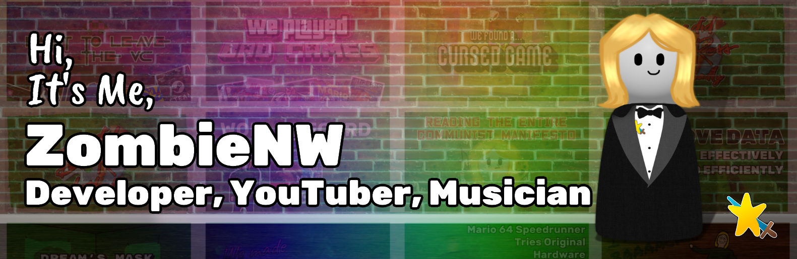

# Hi, It's Me, ZombieNW 👋

    

Hi! I'm ZombieNW, a teenage developer trying to expand his skillset. I started out making Scratch games and writing batch scripts as a young-un and now I'm on to making websites with Sveltekit and writing advanced Minecraft plugins. My proudest accomplishment is probably making a overly-polished clone of Pong in 3D for the Wii. If you want to reach out, feel free to join my Discord Server.

<h3 align="left">Connect with me:</h3>

